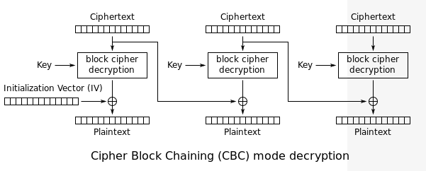

# Set 3

# Challenge 17: The CBC padding oracle

> The CBC padding oracle
This is the best-known attack on modern block-cipher cryptography.
Combine your padding code and your CBC code to write two functions.
The first function should select at random one of the following 10 strings:

```
MDAwMDAwTm93IHRoYXQgdGhlIHBhcnR5IGlzIGp1bXBpbmc=
MDAwMDAxV2l0aCB0aGUgYmFzcyBraWNrZWQgaW4gYW5kIHRoZSBWZWdhJ3MgYXJlIHB1bXBpbic=
MDAwMDAyUXVpY2sgdG8gdGhlIHBvaW50LCB0byB0aGUgcG9pbnQsIG5vIGZha2luZw==
MDAwMDAzQ29va2luZyBNQydzIGxpa2UgYSBwb3VuZCBvZiBiYWNvbg==
MDAwMDA0QnVybmluZyAnZW0sIGlmIHlvdSBhaW4ndCBxdWljayBhbmQgbmltYmxl
MDAwMDA1SSBnbyBjcmF6eSB3aGVuIEkgaGVhciBhIGN5bWJhbA==
MDAwMDA2QW5kIGEgaGlnaCBoYXQgd2l0aCBhIHNvdXBlZCB1cCB0ZW1wbw==
MDAwMDA3SSdtIG9uIGEgcm9sbCwgaXQncyB0aW1lIHRvIGdvIHNvbG8=
MDAwMDA4b2xsaW4nIGluIG15IGZpdmUgcG9pbnQgb2g=
MDAwMDA5aXRoIG15IHJhZy10b3AgZG93biBzbyBteSBoYWlyIGNhbiBibG93
```

> ... generate a random AES key (which it should save for all future encryption), pad the string out to the 16-byte AES block size and CBC-encrypt it under that key, providing the caller the ciphertext and IV. The second function should consume the ciphertext produced by the first function, decrypt it, check its padding, and return true or false depending on whether the padding is valid.
What you're doing here. This pair of functions approximates AES-CBC encryption as its deployed server side in web applications; the second function models the server's consumption of an encrypted session token, as if it was a cookie.

---

---

### **Background**

In cryptography, a padding oracle attack is an attack which uses the padding validation of a cryptographic message to decrypt the ciphertext. In cryptography, variable-length plaintext messages often have to be padded (expanded) to be compatible with the underlying cryptographic primitive. The attack relies on having a "padding oracle" who freely responds to queries about whether a message is correctly padded or not. Padding oracle attacks are mostly associated with CBC mode decryption used within block ciphers.

### Padding Oracle attack on CBC Encryption



$$    {\displaystyle P_{i}=D_{K}(C_{i})\oplus C_{i-1}} \space \space where\space     {C_{0}} = IV . $$


how this will work with,

$$P_{i}=decrypt(C_{i})⊕C_{i−1}$$

According to the problem the only thing we have access to is the cipher text blocks so we need to change the cipher text blocks and obtain the plain text. Also, when we change the a single byte of say C(0) plain text of P(1) will change. 


When we get the last byte then for the second last byte we need to make sure that we change the last byte into '\xo2'

'\x02'  $= dec(C_{1}(15))\space xor \space c_0(15)$  , we can change the cipher text of block zero and can obtain the decrypted cipher text using I(1) 15 (shown above).(!!the first byte can be 2 values as \x00 and \x01 will both give vaild padding so the program requires more than one iterations!!)
