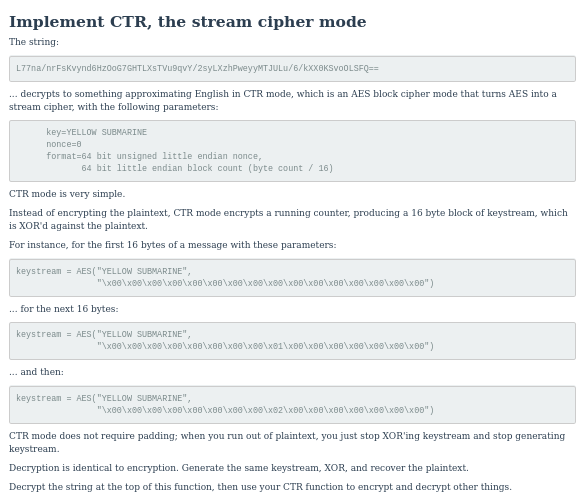

# Challenge 18 : Implement CTR, the stream cipher mode

Ok a new type of cipher to work with great, let's first go to Wikipedia to learn a bit about the cipher.

CTR unlike CBC uses a counter which is any number generated by a function which will not be repeated for a long time, the challenges quite nicely explains what is to be done. After doing mine I saw some other solutions and quite liked

)

A new thing I found (Yeah I feel like a noob) is the use of generators. 

### Generators in Python

Let's say you wanted to make a list from a really really long list but sometimes you would use 10 items from it and sometimes you needed 1000 items. Say you implemented a for loop which makes your shiny new list. The computational resource wasted while making the list when you need only 10 items makes you feel stupid (Don't worry you are just a noob like me and generators will save you.)

Generators basically are used to create iterators, but only when you need them. So the new item in list is taken out only when the program needs it. For a function it will save the state of function and continue from there whenever it needs to. An excellent look at generators can be found at.

[How - and why - you should use Python Generators](https://www.freecodecamp.org/news/how-and-why-you-should-use-python-generators-f6fb56650888/)
