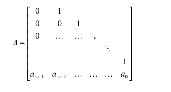

# Implement the MT19937 Mersenne Twister RNG

Let's get a few things out of the way,

> Mersenne Twister is a pseudo random number generator whose period length is chosen to be a Mersenne Prime. Standard implementation uses Mersenne Prime $2^{19937}−1$ and uses 32 bit word length.

> A Mersenne Prime is prime number that is one less than the power of two. $M_{n} = 2^n - 1 \space$ for some prime integer n. [https://en.wikipedia.org/wiki/Mersenne_prime](https://en.wikipedia.org/wiki/Mersenne_prime)

## Let's Get the Math

I didn't find any article to dumb down what the algorithm, so I decided to write one. Let's get started, ( Most things are copied from Wikipedia it's just my intention to understand them.  )

> For a ${w}$ bit word length, the Mersenne Twister generates integers in the range $(0, 2^{w−1})$.                                                                                                             The Mersenne Twister algorithm is based on a [matrix linear recurrence](https://en.wikipedia.org/wiki/Recurrence_relation) over a finite [binary](https://en.wikipedia.org/wiki/Binary_numeral_system) [field](https://en.wikipedia.org/wiki/Field_(mathematics)) $F_{2}$.

A recurrence relation is just an equation that recursively defines a sequence or multidimensional array of values, using initial items. In layman's term it is just using a new value to find out the old one such that each new value is generated using old value using this relation.

A factorial is a recurrence relation ($n!=n(n-1)!\space for\space n\geq 0$) where initial value is $0!=1$.

A linear recurrence can be solved using matrix as described here.

Essentially, here we are dealing with a matrix recurrence relation meaning a matrix is used to find the next value of matrix. This is defined over the binary field i.e field with binary numbers, a field is nothing but a set of numbers where the usual operations like addition, subtraction are defined.

The recurrence relation is,

 $x_{k+n} := x_{k+m} \oplus \space({x_{k}^u\space |\space x_{k+1}^l})\space A$

Here $n$ is degree of recurrence 

Integer $m,1\leq m \leq n$

A is a $w * w$  matrix choose to ease the multiplication where 

$A={\begin{pmatrix}0&I_{w-1}\\a_{w-1}&(a_{w-2},\ldots ,a_{0})\end{pmatrix}}$

$k$ is $0,1,2.........$ (i.e the matrix will look like)

$x_{n}$ is a row vector of a word size  which is generated with  $k =x_{0}, x_{1}, ...., x_{n-1}$ are initial seeds.

$x_{k+1}^l$ are lower or rightmost $r$ bits of $x_{k+1}$

$x_{k}^u$ are upper or leftmost $w-r$ bits of $x_{k}$

$\oplus$ is bit-wise XOR and $|$ denotes concatenation.

But we don't need to do all this we shouldn't do all this, the algorithm defines what we must do.

### For the Program

We don't need to understand every bit of math but a little knowledge is needed. Let's break down the pseudo code.

