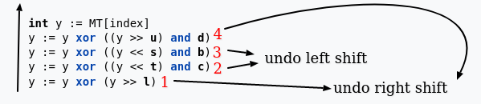

# Clone an MT19937 RNG from its Output

Based on excellent Solutions from

 [`https://cedricvanrompay.gitlab.io/cryptopals/challenges/21.html`](https://cedricvanrompay.gitlab.io/cryptopals/challenges/21.html) and 

[`https://ljhsiung.com/posts/cryptopals-set-3/`](https://ljhsiung.com/posts/cryptopals-set-3/)  

A cryptographically secure PRNG must hold is even if attacker knows partial sequence of output, the attacker shouldn't be able to distinguish it from truly random sequence and hence is not able to predict any future output. Any attacker can easily clone  clone an MT19937 RNG from its output.

The Algorithm works as follows:

1. First we initialize the parameters.
2. Define higher and lower mask
3. Then we use the seed and an equation to generate 1 to 624 numbers.
4. The 624 numbers are put through several shifts to give us the random number.

Our job is to revert the number to the 624 numbers untempering the tempering function. Let's see the tempering function in action.

Let's work on the first right sift operation.

PS : We have assumed that we need to obtain `X0 X1 X2...X7` from given `Y0 Y1 Y2...Y7` (number that we have at beginning which is the result). these are assumed to be stream of bits or string of binary numbers.

Then we focus on reversing the left shift operation.

Though the last left shift operation has a `AND` operator sine it is $FFFFFFFF_{16}$ which is just `1's` which then gives out the same number and has no significance.
