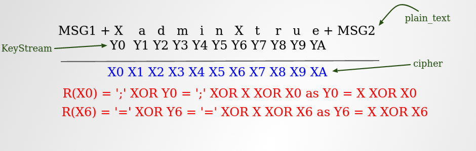

# CTR bitflipping

First according to [https://cryptopals.com/sets/2/challenges/16](https://cryptopals.com/sets/2/challenges/16) we first have to create a function that takes in a user_given text appends it to the middle of two strings without ';' and '=' and encrypts it under CTR. We also need a function that decrypts the encrypted text in CTR.

```python
def decryption_oracle(ctxt:bytes)->bytes:
    return(ctr_mode(ctxt,key,nonce))

def encryption_oracle(text:bytes)->bytes:
    user_data = b''
    for i in text:
        if i == 59 or i == 61:
            continue
        user_data = user_data + bytes([i])
        
    msg_1 = b"comment1=cooking%20MCs;userdata="
    msg_3 = b";comment2=%20like%20a%20pound%20of%20bacon"
    return(ctr_mode(msg_1+user_data+msg_3,key,nonce))
```

Then by using the property of `XOR`  and `CTR Encryption` i.e the size of cipher text doesn't change on encryption and if key and nonce is same same key-stream encrypts the cipher text we bit filp our answer.



R(X0) refers to the required bytes for cipher to decrypt to ';'
