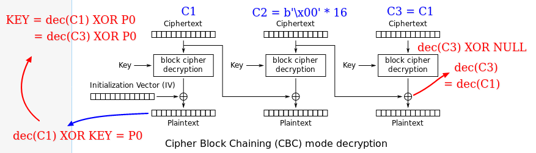

# Recover the key from CBC with IV=Key

We have an encryption oracle where we can send cipher texts, cipher text is decrypted but is not displayed. The deciphered text is only shown in case of errors, according to the question it is Verified each byte of the plaintext for ASCII compliance. If deciphered text doesn't comply then we are given the plain text as an error.

