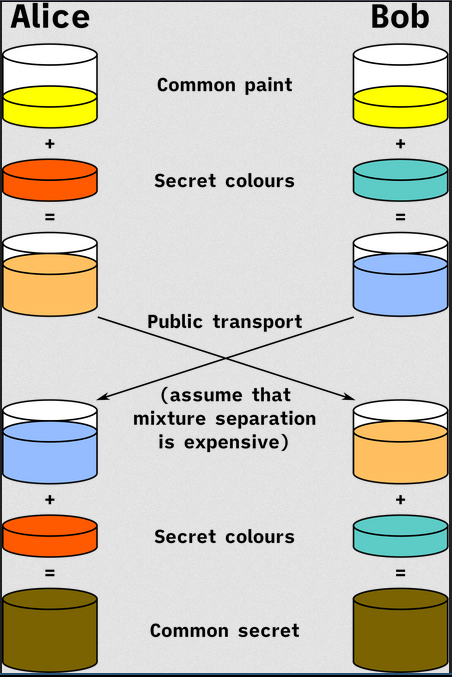

# Implement Diffie-Hellman

### In Essence

      `generator g` → yellow 

`private keys` → orange and dark blue 

`public key` → light orange and light blue 

`encryption ko kura` → is done by brown 

### Mathematically,

First we agree Alice and Bob agree on two integers a generator (g) and a prime number (n)

Now Alice and Bob share two numbers a and b as the powers of g,

looking at it one would think easy yeah just revert `a` from `A` but that in essence is the discrete log problem. now Alice and Bob share their public keys `A` and `B` and create their keys as 

$$A^b\mod n =  (g^a \mod n)^b\mod n = (g)^{ab} \mod n \space (for Bob) $$

$$A^a\mod n =  (g^a \mod n)^a\mod n = (g)^{ab} \mod n \space (for Alice) $$

### Man in the middle attack.

The fault in this encryption system is that it doesn't try to authenticate who the message is from any one can send the message pretending to be anyone. If anyone is in control of the network and intercept the message you can pretend to be someone else and communicate with both parties.

