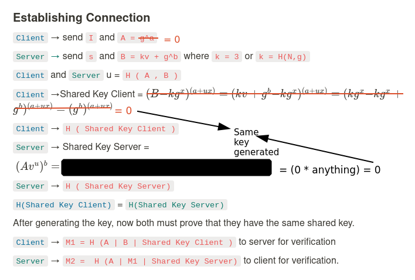

# Break SRP with a zero key

Client controls the parameters `A = g^a = g^0` which makes the Shared Key Server  0 ($(Av^u)^b )$  ). While sending `M1` we can make Shared Key Client to be 0 authenticating without any knowledge of the verifier.

