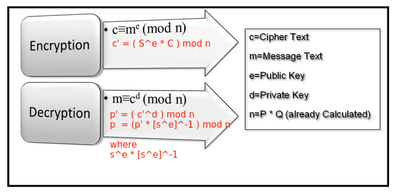

# Implement unpadded message recovery oracle

The Challenge is simple say we have a server which decrypts ciphertext sent using private key and we only get the public key for encryption. What the challenge focuses on is Bob Identifying Alice, any ciphertext encrypted by BOB should get decrypted and verified while others must be rejected. 

The attack focuses on decrypting a ciphertext form a server which will decrypt or encrypt anything we send it except except a chosen ciphertext. 

RSA has mathematical operations meaning if we multiply or divide anything modulo N, and do the reverse on plain text, then it should be the same of what plaintext one would get if the original ciphertext was chosen. 

