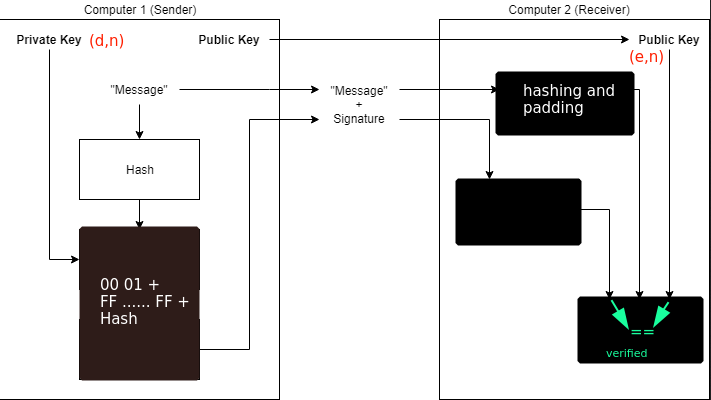

# Bleichenbacher's e=3 RSA Attack

REF : [https://blog.filippo.io/bleichenbacher-06-signature-forgery-in-python-rsa/](https://blog.filippo.io/bleichenbacher-06-signature-forgery-in-python-rsa/)

Signing by RSA, 

### PKCS #1 1.5

00 01 FF FF FF FF.............FF 00 ASN.1 HASH GARBAGE

### Old Parser Root of the Issue

To pass the verification a few things must match:

→ decrypted message must start with `'\x00\x01'`

→ decrypted message must have the ASN.1  for the hash type followed by hash

→ parser only checks required number of bytes for hash after `ASN.1` bytes i.e they don't need to be the ending bytes

### The Attack

The encryption follows `c = m^d mod N` and decryption follows `m = c^e mod N`.

Essentially for low exponent like `e=3` during decryption what you send will be raised to the power three. What we do is take the cube root of what `e` need, approximate it so that when the server raises to the third power, it decrypts to what we intend. Since the approximation may not be accurate to the trailing bits. We append the garbage value.

Server : `m = ((m')^1/3)^3 mod N = m'`
