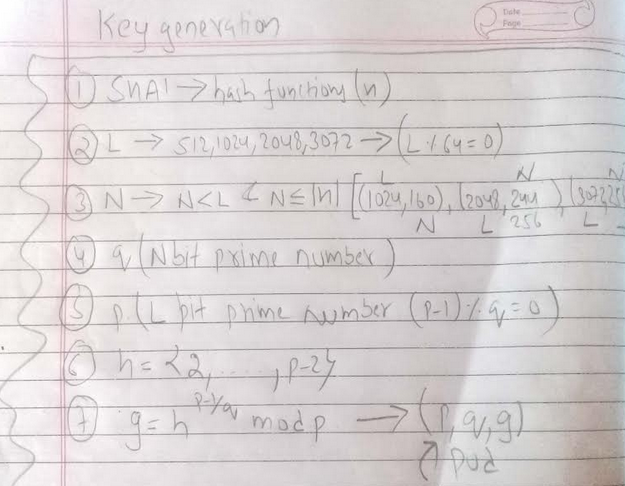
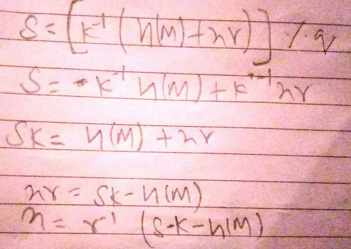

# DSA key recovery from nonce

## DSA how messages are signed and verified?

### First we generate the key parameters,

### Each user who sign the message generate, Per-user keys

## Signing

Public Key = (p,q,alpha,y)

Private Key = (x)

## Verifying

# Key Recovery

If we have the signature we can recover the private key as follows,

