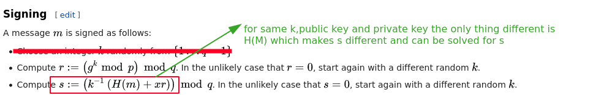

# DSA nonce recovery from repeated nonce

Let's say we are signing a group of messages, using the same private and public key. The only thing that is different between the two signed messages will be the value of nonce `k` 

When the same `k` is used for signing,

Mathematically we can solve for k using the following,

