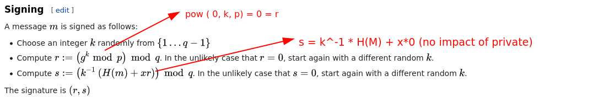

# DSA Parameter Tampering

# When the generator is 0

## When the generator is p+1

When the generator is `p+1` anything that is `%p` will be `1` . Mathematically  `(r , s)`  can be `(1 , anything )` and is verified. Mathematically this can be broken down into. 

