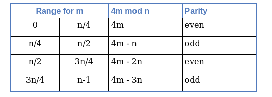

# RSA Parity Oracle

---

**[ Solution Based on Paper ]** 

[Practical Padding Oracle Attacks on RSA](http://secgroup.dais.unive.it/wp-content/uploads/2012/11/Practical-Padding-Oracle-Attacks-on-RSA.html)

---

→ This attack works due to leaking of the Least Significant Bit by an unpadded RSA encryption/decryption which helps us to decrypt the cipher text in log_2(N) request to the oracle.

→ This is a side channel attack in which the last bit or Least Significant Bit is leaked through which the whole plain text can be recovered. 

→ This fact is sometimes regarded as a good property of the cipher: if there is no way to compute the plaintext we are also guaranteed that it is not even possible to just compute the parity bit of the plaintext (as otherwise we would use the attack to reconstruct the whole message).

### Background

RSA has multiplicative property i.e if we `E(m).E(s) mod n = E(m.s)` which then decrypts to `m.s` . Multiplying two ciphers and decrypting them will give us, give us the product of two plaintext which encrypts to the ciphers.

We will have cipher text ( c )  which we will multiply by ( `2^(ie)` ) which will then decrypt to ( `2^i * m` ). We can then successive values of i to generate (2m,4m......) which will give us a better idea of `m`

### Exploit

Say `m < n/2` then `2m mod n = 2m` which is even, 

when `m > n/2` then `2m mod n = 2m-n` which odd,

This gives us an idea of where the ciphertext lies the upper or lower half of [ 0 , n/2 ,n ] 

For 2^2 this further divides the range in which m lies to half..

 This is essentially binary search, we are making the possible range half each time we conduct a multiplication with `2^i` . Since this resembles binary search the total number of iterations will be log_2( N ).
